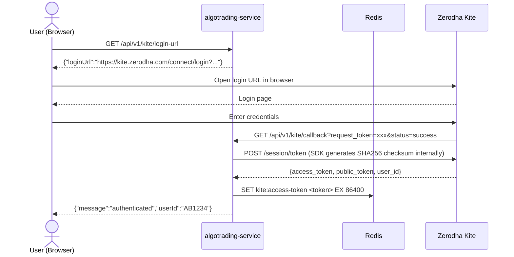
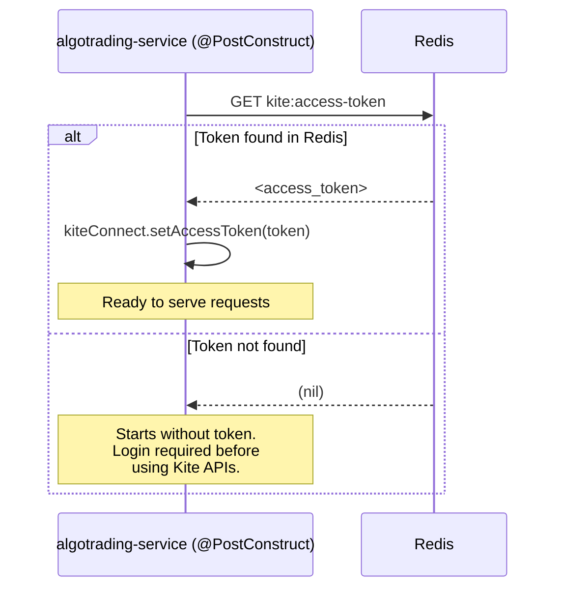
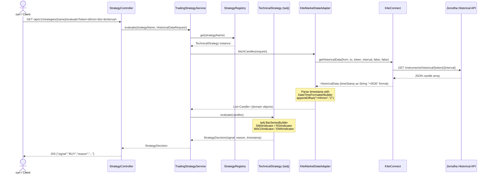
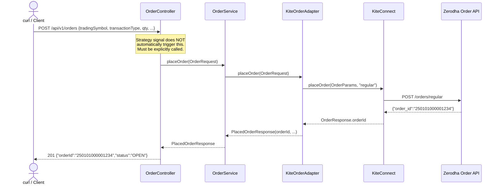
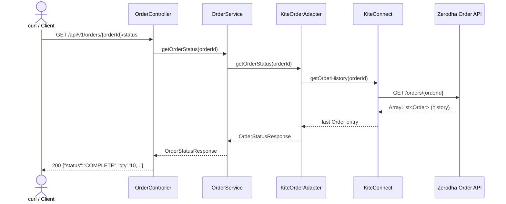

# algotrading-service

Production-grade algorithmic trading framework built on:

| Layer | Technology |
|---|---|
| Runtime | Java 21 |
| Framework | Spring Boot 4.0.6 / Spring Framework 7 |
| Technical Analysis | ta4j 0.22.6 |
| Broker API | Zerodha Kite Connect SDK 4.0.0 |
| Token Cache | Redis 7 (Spring Data Redis) |
| Build | Maven 3.9+ |
| Containers | Docker Compose |

---

## Project Overview

This service exposes a REST API that:

1. Authenticates with Zerodha's Kite Connect via an OAuth-style callback flow
2. Lists tradable instruments from Kite's instrument master as JSON
3. Fetches historical OHLCV candles from Kite
4. Evaluates pluggable technical strategies (SMA Crossover, RSI Mean Reversion, GAINZ_ALPHA_V2)
5. Places and monitors orders via Kite order APIs
6. Caches the access token in Redis so a server restart does not require re-authentication

**Strategy evaluation and order placement are explicitly decoupled.**
A strategy signal never automatically places an order.

---

## Architecture Overview

```
┌───────────────────────────────────────────────────────┐
│                    REST Controllers                    │
│ KiteAuthController        InstrumentController        │
│ StrategyController        OrderController             │
└────────────┬───────────────┬────────────────┬─────────┘
             │               │                │
     ┌───────▼──────┐ ┌──────▼──────┐ ┌──────▼──────┐
     │KiteAuthService│ │TradingStrategy│ │ OrderService │
     │               │ │   Service   │ │             │
     └──┬────────┬───┘ └──┬──────┬──┘ └──────┬──────┘
        │        │        │      │            │
  ┌─────▼─┐ ┌───▼──┐ ┌───▼─┐ ┌──▼────────┐ ┌▼────────────┐
  │ Redis │ │Kite  │ │Strat│ │KiteMarket │ │KiteOrder    │
  │ Token │ │Connect│ │egies│ │DataAdapter│ │Adapter      │
  │ Cache │ │ Bean │ │(ta4j│ │           │ │             │
  └───────┘ └──────┘ └─────┘ └───────────┘ └─────────────┘
                                                │
                                         ┌──────▼──────┐
                                         │  Zerodha    │
                                         │  Kite APIs  │
                                         └─────────────┘
```

### Hexagonal / Clean Architecture

- **Domain** (`model/`, `strategy/`, `order/`): pure Java records and interfaces; zero SDK imports
- **Adapters** (`market/KiteMarketDataAdapter`, `order/KiteOrderAdapter`): the only classes that import `com.zerodhatech.*`
- **Ports** (`MarketDataPort`, `OrderPort`): interfaces that decouple domain from infrastructure
- **Config** (`config/`): Spring wiring; no business logic

---

## Setup Instructions

### Prerequisites

- Java 21
- Maven 3.9+
- Docker + Docker Compose (for Redis)
- Zerodha Kite Connect app with **paid plan** (Historical Data requires paid plan)

### 1. Create Kite Connect App

1. Go to [Zerodha Developer Console](https://developers.kite.trade/)
2. Sign up → Create App
3. Set **Redirect URL** to: `http://127.0.0.1:8080/api/v1/kite/callback`
4. Note your `api_key` and `api_secret`

### 2. Configure Environment Variables

```bash
export KITE_API_KEY=your_api_key
export KITE_API_SECRET=your_api_secret
export KITE_USER_ID=your_zerodha_client_id        # e.g. AB1234
export KITE_REDIRECT_URL=http://127.0.0.1:8080/api/v1/kite/callback
```

### 3. Start Redis

```bash
docker-compose up redis -d
```

### 4. Build and Run

```bash
mvn clean package -DskipTests
java -jar target/algotrading-service-1.0.0-SNAPSHOT.jar
```

Or with Maven:

```bash
mvn spring-boot:run
```

---

## Docker Compose (Full Stack)

```bash
# Build the fat jar first
mvn clean package -DskipTests

# Start Redis + App together
KITE_API_KEY=xxx KITE_API_SECRET=yyy KITE_USER_ID=zzz docker-compose up --build
```

Services exposed:
- App: `http://localhost:8080`
- Redis: `localhost:6379`

---

## Environment Variables

| Variable | Required | Description |
|---|---|---|
| `KITE_API_KEY` | Yes | API key from Kite Developer Console |
| `KITE_API_SECRET` | Yes | API secret from Kite Developer Console |
| `KITE_USER_ID` | Yes | Your Zerodha client ID (e.g. `AB1234`) |
| `KITE_REDIRECT_URL` | Yes | Must match app's redirect URL in Kite console |
| `SPRING_DATA_REDIS_HOST` | No | Redis host (default: `localhost`) |
| `SPRING_DATA_REDIS_PORT` | No | Redis port (default: `6379`) |

---

## Kite Connect Authentication Flow

> **Important limitation:** A new access token **cannot** be generated automatically on startup.
> Zerodha requires a **browser-based login** to obtain a one-time `request_token`.
> The application can only reuse a token from Redis if one was cached previously.
> If no cached token exists, you must complete the login flow below.

### Step-by-step

```
1. GET /api/v1/kite/login-url     ← get the Zerodha login URL
2. Open that URL in a browser     ← user logs in on Zerodha's website
3. Zerodha redirects to:
   GET /api/v1/kite/callback
       ?request_token=xxx&action=login&status=success
4. Server exchanges request_token → access_token (SDK does SHA-256 internally)
5. access_token stored in Redis with 24h TTL
6. All Kite-backed endpoints are now usable
```

### On Application Restart

- If `kite:access-token` key exists in Redis → token is automatically applied at startup
- If key is absent or expired → app starts normally, login required before using Kite APIs



---

## Redis Token Cache Flow



---

## Strategy Execution Flow



---

## Order Placement Flow



---

## Order Status Check Flow



---

## API Reference & curl Examples

### Authentication

#### Get Login URL
```bash
curl http://localhost:8080/api/v1/kite/login-url
# Response:
# {"loginUrl":"https://kite.zerodha.com/connect/login?v=3&api_key=xxx","instruction":"Open this URL in a browser"}
```
> Open the URL in a browser — Zerodha requires browser-based login.

#### Check Auth Status
```bash
curl http://localhost:8080/api/v1/kite/status
# Authenticated: {"authenticated":true,"message":"Kite session is active."}
# Not auth'd:    {"authenticated":false,"loginUrl":"/api/v1/kite/login-url"}
```

#### Callback (called automatically by Zerodha)
```bash
# This is called by Zerodha's redirect, not manually.
# Zerodha redirects to:
# GET http://127.0.0.1:8080/api/v1/kite/callback
#     ?request_token=xxxxxxxxxxxxxxxx&action=login&status=success
```

---

### Instruments

#### List All Instruments
```bash
curl http://localhost:8080/api/v1/instruments
```

Returns Kite's full instrument master as parsed JSON. The response can be large because it includes all tradable instruments across exchanges.

#### List Instruments by Exchange
```bash
curl "http://localhost:8080/api/v1/instruments?exchange=NSE"
```

#### Example Response
```json
[
  {
    "instrumentToken": 408065,
    "exchangeToken": 1594,
    "tradingSymbol": "INFY",
    "name": "INFOSYS",
    "lastPrice": 0.0,
    "expiry": null,
    "strike": null,
    "tickSize": 0.05,
    "lotSize": 1,
    "instrumentType": "EQ",
    "segment": "NSE",
    "exchange": "NSE"
  }
]
```

#### Query Parameter Reference

| Parameter | Required | Description | Example |
|---|---|---|---|
| `exchange` | No | Restricts the list to one exchange. Omit it to return all instruments. | `NSE`, `BSE`, `NFO`, `MCX` |

Use `instrumentToken` from this endpoint as the `token` query parameter for strategy evaluation.

---

### Strategy Evaluation

#### List All Strategies
```bash
curl http://localhost:8080/api/v1/strategies
# ["SMA_CROSSOVER","RSI_MEAN_REVERSION","GAINZ_ALPHA_V2"]
```

#### Evaluate SMA_CROSSOVER
```bash
curl "http://localhost:8080/api/v1/strategies/SMA_CROSSOVER/evaluate\
?token=256265&from=2024-01-01&to=2024-06-30&interval=day"
```

#### Evaluate RSI_MEAN_REVERSION
```bash
curl "http://localhost:8080/api/v1/strategies/RSI_MEAN_REVERSION/evaluate\
?token=256265&from=2024-01-01&to=2024-06-30&interval=day"
```

#### Evaluate GAINZ_ALPHA_V2
```bash
curl "http://localhost:8080/api/v1/strategies/GAINZ_ALPHA_V2/evaluate\
?token=256265&from=2024-01-01&to=2024-06-30&interval=day"
```

#### Query Parameter Reference

| Parameter | Description | Example |
|---|---|---|
| `{strategyName}` | Path variable — registered strategy name | `SMA_CROSSOVER`, `GAINZ_ALPHA_V2` |
| `token` | **Zerodha instrument token** — NOT the access_token. Find tokens via `GET /api/v1/instruments` | `256265` (NIFTY 50 index) |
| `from` | Historical candle start date (ISO 8601) | `2024-01-01` |
| `to` | Historical candle end date (ISO 8601) | `2024-06-30` |
| `interval` | Candle granularity | `minute`, `5minute`, `15minute`, `30minute`, `60minute`, `day` |

#### Interpreting the Response

```json
{
  "strategyName": "GAINZ_ALPHA_V2",
  "signal": "BUY",
  "reason": "BUY confluence: SMA(10/155.40)>SMA(30/142.10), RSI=65.32 in (40,80), MACD=1.2340>Signal=0.8910, Vol=350000>AvgVol=120000",
  "evaluatedAt": "2024-06-30T10:15:30Z"
}
```

| Signal | Meaning | Action |
|---|---|---|
| `BUY` | All bullish conditions confirmed | Consider a long entry (manually place order via `POST /api/v1/orders`) |
| `SELL` | All bearish conditions confirmed | Consider a short exit or short entry |
| `HOLD` | Conditions are not fully aligned | Stay in current position; do not act |

> **Signal ≠ Order.** You must explicitly call `POST /api/v1/orders` to place a trade.

---

### Order Management

> ⚠️ **Safety Note:** Orders sent to Kite are real. Use CNC/MIS with small quantities for testing.
> Strategy evaluation never auto-places orders.

#### Place a BUY Order (Market)
```bash
curl -X POST http://localhost:8080/api/v1/orders \
  -H "Content-Type: application/json" \
  -d '{
    "tradingSymbol":   "INFY",
    "exchange":        "NSE",
    "transactionType": "BUY",
    "quantity":        1,
    "orderType":       "MARKET",
    "product":         "CNC",
    "price":           0
  }'
# Response 201:
# {"orderId":"250101000001234","tradingSymbol":"INFY","transactionType":"BUY","quantity":1,"status":"OPEN"}
```

#### Place a SELL Order (Limit)
```bash
curl -X POST http://localhost:8080/api/v1/orders \
  -H "Content-Type: application/json" \
  -d '{
    "tradingSymbol":   "INFY",
    "exchange":        "NSE",
    "transactionType": "SELL",
    "quantity":        1,
    "orderType":       "LIMIT",
    "product":         "CNC",
    "price":           1750.50
  }'
```

#### Check Order Status
```bash
curl http://localhost:8080/api/v1/orders/250101000001234/status
# {"orderId":"250101000001234","status":"COMPLETE","tradingSymbol":"INFY","quantity":1}
```

#### Order Field Reference

| Field | Values | Notes |
|---|---|---|
| `tradingSymbol` | `INFY`, `RELIANCE`, `NIFTY24DECFUT` | NSE/BSE symbol |
| `exchange` | `NSE`, `BSE`, `NFO`, `MCX` | |
| `transactionType` | `BUY`, `SELL` | |
| `quantity` | positive integer | Number of shares/lots |
| `orderType` | `MARKET`, `LIMIT`, `SL`, `SL-M` | |
| `product` | `CNC`, `MIS`, `NRML` | CNC=delivery, MIS=intraday, NRML=F&O |
| `price` | decimal | Use `0` for MARKET orders |

---

## Common Instrument Tokens

| Symbol | Token | Exchange |
|---|---|---|
| NIFTY 50 (index) | `256265` | NSE |
| BANK NIFTY | `260105` | NSE |
| INFY | `408065` | NSE |
| RELIANCE | `738561` | NSE |

> Get the full parsed instrument list from this service: `GET /api/v1/instruments`
> Filter by exchange when possible, for example: `GET /api/v1/instruments?exchange=NSE`

---

## GAINZ_ALPHA_V2 Strategy Details

Multi-indicator confluence strategy requiring **all four conditions** simultaneously.

| Condition | BUY | SELL |
|---|---|---|
| SMA trend | SMA(10) > SMA(30) | SMA(10) < SMA(30) |
| RSI momentum | 40 < RSI(14) < 80 | 20 < RSI(14) < 60 |
| MACD | MACD(12,26) > Signal(9) | MACD(12,26) < Signal(9) |
| Volume | Current > 20-bar avg volume | Current > 20-bar avg volume |

**Minimum bars required:** 35 candles  
**ta4j indicators used:** `SMAIndicator`, `RSIIndicator`, `MACDIndicator`, `EMAIndicator` (signal line), `ClosePriceIndicator`

---

## Testing

```bash
# Run all tests
mvn test

# Run specific test class
mvn test -Dtest=GainzAlphaV2StrategyTest

# Run with verbose output
mvn test -Dsurefire.useFile=false
```

Expected:
```
Tests run: 44, Failures: 0, Errors: 0, Skipped: 0
BUILD SUCCESS
```

---

## Complete Project Structure

```
algotrading-service/
├── docker-compose.yml
├── Dockerfile
├── pom.xml
├── README.md
└── src/
    ├── main/
    │   ├── java/com/algotrading/app/
    │   │   ├── AlgoTradingApplication.java
    │   │   ├── auth/
    │   │   │   ├── KiteAuthConfig.java
    │   │   │   ├── KiteAuthException.java
    │   │   │   ├── KiteAuthService.java
    │   │   │   └── KiteSessionStore.java
    │   │   ├── config/
    │   │   │   ├── KiteConfig.java
    │   │   │   └── KiteProperties.java
    │   │   ├── controller/
    │   │   │   ├── InstrumentController.java
    │   │   │   ├── KiteAuthController.java
    │   │   │   ├── OrderController.java
    │   │   │   └── StrategyController.java
    │   │   ├── exception/
    │   │   │   ├── GlobalExceptionHandler.java
    │   │   │   ├── MarketDataException.java
    │   │   │   └── StrategyNotFoundException.java
    │   │   ├── market/
    │   │   │   ├── KiteMarketDataAdapter.java   ← timestamp fix (+0530)
    │   │   │   └── MarketDataPort.java
    │   │   ├── model/
    │   │   │   ├── Candle.java
    │   │   │   ├── HistoricalDataRequest.java
    │   │   │   ├── StrategyDecision.java
    │   │   │   └── TradingSignal.java
    │   │   ├── order/
    │   │   │   ├── KiteOrderAdapter.java
    │   │   │   ├── OrderPort.java
    │   │   │   ├── OrderRequest.java
    │   │   │   ├── OrderService.java
    │   │   │   ├── OrderStatusResponse.java
    │   │   │   └── PlacedOrderResponse.java
    │   │   ├── redis/
    │   │   │   ├── RedisConfig.java
    │   │   │   └── RedisTokenCacheService.java
    │   │   ├── service/
    │   │   │   └── TradingStrategyService.java
    │   │   ├── strategy/
    │   │   │   ├── GainzAlphaV2Strategy.java   ← NEW
    │   │   │   ├── RsiMeanReversionStrategy.java
    │   │   │   ├── SmaCrossoverStrategy.java
    │   │   │   ├── StrategyRegistry.java
    │   │   │   └── TechnicalStrategy.java
    │   │   └── util/
    │   │       └── BarSeriesFactory.java
    │   └── resources/
    │       └── application.yml
    └── test/
        └── java/com/algotrading/app/
            ├── model/CandleMappingTest.java
            ├── service/TradingStrategyServiceTest.java
            ├── strategy/
            │   ├── GainzAlphaV2StrategyTest.java  ← NEW
            │   ├── RsiMeanReversionStrategyTest.java
            │   ├── SmaCrossoverStrategyTest.java
            │   └── StrategyRegistryTest.java
            └── util/
                ├── BarSeriesFactoryTest.java
                └── CandleTestFactory.java
```
