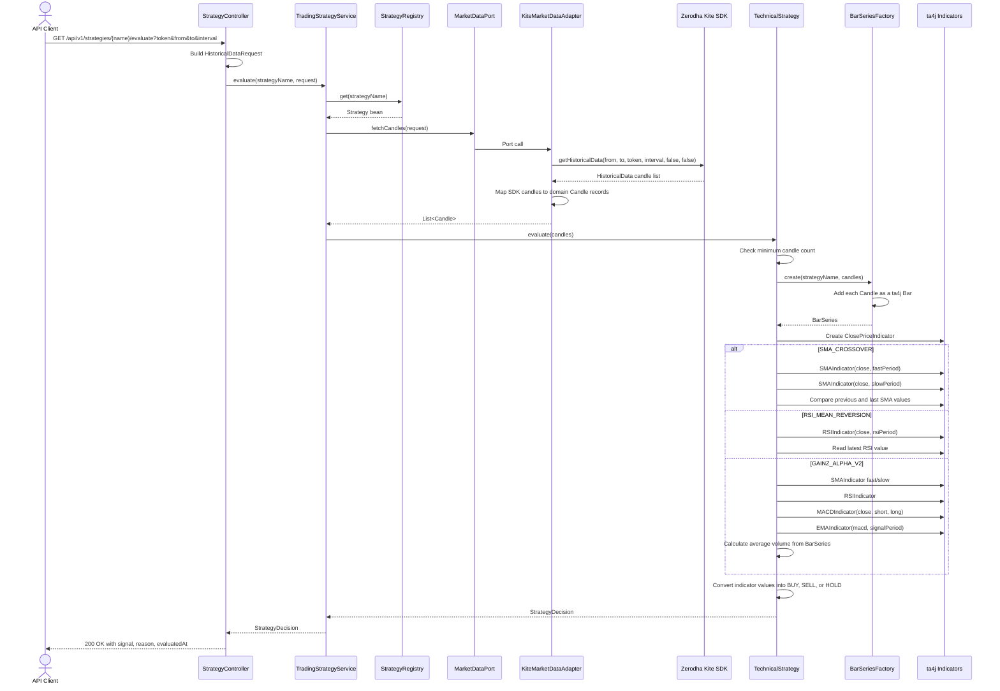

# ta4j Strategy Implementation

This document explains how the project uses ta4j to implement trading strategies, how candle data moves through the system, and what each implemented strategy is meant to detect.

## Sequence Diagram



## Strategy Name Full Forms

| Strategy Name | Full Form | Meaning |
|---|---|---|
| `SMA_CROSSOVER` | Simple Moving Average Crossover | Uses a fast and slow moving average to detect trend changes |
| `RSI_MEAN_REVERSION` | Relative Strength Index Mean Reversion | Uses RSI to detect overbought or oversold price movement |
| `GAINZ_ALPHA_V2` | Gainz Alpha Version 2 | Project-specific multi-indicator alpha strategy using SMA, RSI, MACD, and volume |

Indicator full forms:

| Short Name | Full Form | Purpose |
|---|---|---|
| `SMA` | Simple Moving Average | Smooths price to identify trend direction |
| `RSI` | Relative Strength Index | Measures momentum and overbought/oversold behavior |
| `MACD` | Moving Average Convergence Divergence | Measures trend momentum using two moving averages |
| `EMA` | Exponential Moving Average | Moving average that weights recent values more heavily |

`GAINZ_ALPHA_V2` is not a standard market-indicator abbreviation like SMA or RSI. In this codebase, it is the project's named alpha strategy, version 2.

## How ta4j Is Used

The service does not implement technical indicators manually. It uses ta4j as the indicator engine.

The flow is:

1. Kite historical data is converted into project-owned `Candle` records.
2. `BarSeriesFactory` converts `List<Candle>` into a ta4j `BarSeries`.
3. Strategies create ta4j indicators from the `BarSeries`.
4. Strategies inspect the latest indicator values.
5. The final decision is returned as `StrategyDecision`.

The important ta4j concepts in this project are:

| ta4j Type | How It Is Used |
|---|---|
| `BarSeries` | Time-ordered OHLCV market data used by all indicators |
| `ClosePriceIndicator` | Reads the close price from each bar |
| `SMAIndicator` | Calculates simple moving averages for trend and crossover checks |
| `RSIIndicator` | Calculates momentum for mean-reversion and confirmation |
| `MACDIndicator` | Calculates MACD line for trend/momentum confirmation |
| `EMAIndicator` | Calculates MACD signal line |
| `Num` | ta4j numeric abstraction used for indicator comparisons |

The project still owns the strategy rules. ta4j supplies the indicator values; each `TechnicalStrategy` decides how those values become `BUY`, `SELL`, or `HOLD`.

## ta4j Implementation Pattern

Every strategy follows the same implementation pattern:

```java
BarSeries series = barSeriesFactory.create(strategyName, candles);
ClosePriceIndicator close = new ClosePriceIndicator(series);
```

After that, each strategy creates only the indicators it needs.

### Step 1: Convert Domain Candles to ta4j Bars

The service receives normal project `Candle` records:

```java
new Candle(timestamp, open, high, low, close, volume)
```

ta4j indicators do not work directly on this record. They work on `BarSeries`, so `BarSeriesFactory` creates a ta4j series:

```java
BarSeries series = new BaseBarSeriesBuilder()
        .withName(seriesName)
        .build();

series.addBar(
        series.barBuilder()
                .timePeriod(Duration.ofDays(1))
                .endTime(candle.timestamp())
                .openPrice(candle.open())
                .highPrice(candle.high())
                .lowPrice(candle.low())
                .closePrice(candle.close())
                .volume(candle.volume())
                .build()
);
```

This is the bridge between application data and ta4j.

### Step 2: Create a Close Price Indicator

Most technical indicators in this service are calculated from close prices:

```java
ClosePriceIndicator close = new ClosePriceIndicator(series);
```

This tells ta4j: "Use the close price from every bar as the input series."

### Step 3: Create Strategy-Specific Indicators

For SMA crossover:

```java
SMAIndicator fastSma = new SMAIndicator(close, fastPeriod);
SMAIndicator slowSma = new SMAIndicator(close, slowPeriod);
```

For RSI mean reversion:

```java
RSIIndicator rsi = new RSIIndicator(close, rsiPeriod);
```

For GAINZ Alpha V2:

```java
SMAIndicator fastSma = new SMAIndicator(close, smaFastPeriod);
SMAIndicator slowSma = new SMAIndicator(close, smaSlowPeriod);
RSIIndicator rsi = new RSIIndicator(close, rsiPeriod);
MACDIndicator macd = new MACDIndicator(close, macdShort, macdLong);
EMAIndicator signal = new EMAIndicator(macd, macdSignal);
```

### Step 4: Read the Latest Indicator Values

The strategies evaluate the latest completed bar:

```java
int last = series.getEndIndex();
Num fastVal = fastSma.getValue(last);
Num slowVal = slowSma.getValue(last);
double rsiVal = rsi.getValue(last).doubleValue();
```

For crossover strategies, the previous bar is also checked:

```java
int prev = last - 1;
Num fastPrev = fastSma.getValue(prev);
Num slowPrev = slowSma.getValue(prev);
```

This matters because a crossover is not just "fast SMA is above slow SMA". A real crossover means it moved from one side to the other between the previous bar and the latest bar.

### Step 5: Apply Project Strategy Rules

ta4j does the math. The project code decides the signal.

Example:

```java
if (fastPrev.isLessThanOrEqual(slowPrev) && fastLast.isGreaterThan(slowLast)) {
    return StrategyDecision.of("SMA_CROSSOVER", TradingSignal.BUY, "Golden cross...");
}
```

So the implementation split is:

| Responsibility | Owner |
|---|---|
| Storing OHLCV bars | ta4j `BarSeries` |
| Calculating SMA, RSI, MACD, EMA | ta4j indicators |
| Choosing thresholds and conditions | Project strategy classes |
| Returning API response | Project `StrategyDecision` |

## Strategy Purposes

### SMA_CROSSOVER: Simple Moving Average Crossover

Purpose: detect trend changes using two simple moving averages.

- BUY when the fast SMA crosses above the slow SMA on the final bar.
- SELL when the fast SMA crosses below the slow SMA on the final bar.
- HOLD when no crossover happens.

ta4j implementation:

1. Convert candles to `BarSeries`.
2. Create `ClosePriceIndicator`.
3. Create fast `SMAIndicator`.
4. Create slow `SMAIndicator`.
5. Read fast and slow SMA values for previous and latest bars.
6. Return `BUY` only when fast SMA crosses above slow SMA.
7. Return `SELL` only when fast SMA crosses below slow SMA.
8. Return `HOLD` when there is no fresh crossover.

Successful test examples:

- `evaluate_returnsBuy_onGoldenCross`: close prices `{100, 100, 100, 100, 100, 100, 1000}` with test periods fast=3 and slow=5. The final spike moves the fast SMA above the slow SMA, so the strategy returns `BUY`.
- `evaluate_returnsSell_onDeathCross`: close prices `{200, 200, 200, 200, 200, 200, 1}`. The final crash moves the fast SMA below the slow SMA, so the strategy returns `SELL`.
- `evaluate_returnsHold_whenPricesAreFlat`: flat prices keep both SMAs equal, so the strategy returns `HOLD`.

### RSI_MEAN_REVERSION: Relative Strength Index Mean Reversion

Purpose: detect potentially stretched markets that may revert toward the mean.

- BUY when RSI is below the oversold threshold.
- SELL when RSI is above the overbought threshold.
- HOLD when RSI is inside the neutral band.

ta4j implementation:

1. Convert candles to `BarSeries`.
2. Create `ClosePriceIndicator`.
3. Create `RSIIndicator`.
4. Read the latest RSI value.
5. Return `BUY` when RSI is below the oversold threshold.
6. Return `SELL` when RSI is above the overbought threshold.
7. Return `HOLD` when RSI is between the two thresholds.

Successful test examples:

- `evaluate_returnsBuy_whenOversold`: a 30-bar downtrend from 600 with step 20 drives RSI below 30. The strategy returns `BUY`, treating the market as oversold.
- `evaluate_returnsSell_whenOverbought`: a 30-bar uptrend from 100 with step 20 drives RSI above 70. The strategy returns `SELL`, treating the market as overbought.
- `evaluate_returnsHold_whenNeutral`: alternating prices around 100 produce balanced gains and losses. RSI stays inside the neutral band, so the strategy returns `HOLD`.

One important ta4j detail from the tests: completely flat prices are not used as the RSI HOLD example. In ta4j 0.22.6, all-identical closes can produce RSI `0`, which would look oversold.

### GAINZ_ALPHA_V2: Gainz Alpha Version 2

Purpose: require multiple indicators to agree before producing a directional signal.

This is a confluence strategy. It is stricter than a single-indicator strategy.

BUY requires:

- Fast SMA above slow SMA.
- RSI above bullish threshold.
- MACD above signal line.
- Current volume above recent average volume.

SELL requires:

- Fast SMA below slow SMA.
- RSI below bearish threshold.
- MACD below signal line.
- Current volume above recent average volume.

HOLD is returned when the full confluence is missing.

ta4j implementation:

1. Convert candles to `BarSeries`.
2. Create `ClosePriceIndicator`.
3. Create fast and slow `SMAIndicator` instances.
4. Create `RSIIndicator`.
5. Create `MACDIndicator`.
6. Create `EMAIndicator(macd, signalPeriod)` as the MACD signal line.
7. Read current bar volume directly from `BarSeries`.
8. Calculate average volume in project code.
9. Return `BUY` only when SMA trend, RSI, MACD, and volume are all bullish.
10. Return `SELL` only when SMA trend, RSI, MACD, and volume are all bearish.
11. Return `HOLD` when any required condition is missing.

Successful test examples:

- `evaluate_returnsBuy_onFullConfluence`: bullish candles create SMA uptrend, RSI above 40, MACD above signal, and a final volume spike. The strategy returns `BUY`.
- `evaluate_returnsSell_onFullBearishConfluence`: bearish candles create SMA downtrend, RSI below 60, MACD below signal, and a final volume spike. The strategy returns `SELL`.
- `evaluate_returnsHold_whenVolumeConditionFails`: bullish price action is present, but volume is flat. Since current volume is not greater than average volume, the strategy returns `HOLD`.

## Why BarSeriesFactory Matters

`BarSeriesFactory` is the translation layer between the application domain and ta4j.

The application works with this domain model:

```java
record Candle(
    Instant timestamp,
    double open,
    double high,
    double low,
    double close,
    long volume
) {}
```

ta4j works with a `BarSeries`. `BarSeriesFactory` loops through candles and adds each one as a ta4j bar with:

- end time from `candle.timestamp()`
- open price from `candle.open()`
- high price from `candle.high()`
- low price from `candle.low()`
- close price from `candle.close()`
- volume from `candle.volume()`

This keeps strategy code clean. Strategies receive normal application candles but can immediately use ta4j indicators after conversion.

## Simple Mental Model

Think of ta4j as the calculator:

- It calculates SMA, RSI, MACD, and EMA values.
- It stores candles in `BarSeries`.
- It provides comparison-friendly numeric values.

Think of this codebase as the decision maker:

- It decides which indicators to combine.
- It decides thresholds.
- It decides whether the latest bar means `BUY`, `SELL`, or `HOLD`.
- It explains the decision in the response reason.

## Guard Rails Covered by Tests

- Strategies reject `null` candle lists.
- Strategies reject too few candles for the configured indicator periods.
- Strategy decisions include a non-null evaluation timestamp.
- `StrategyRegistry` resolves `GAINZ_ALPHA_V2` by name.
- `StrategyRegistry` lists all three implemented strategy names.

These tests are important because ta4j indicators need enough historical bars to produce meaningful values.
